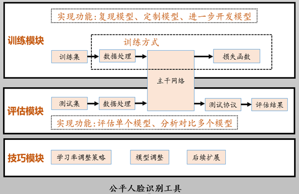

# Fair_Face_tool
## tool introduction
This scheme develops a fair face toolkit for fairness in the field of unstructured data-face recognition, provides a unified training framework for bias mitigation model training, and provides a test protocol for bias mitigation testing, so as to analyze and compare different methods and find appropriate bias mitigation schemes.
At the same time, users can customize and develop new methods through the toolkit.
### The overall framework of the toolkit

## How to use the tool
### Installation    
You use conda to create a virtual environment to run this project.  
  ```
  git clone https://github.com/witzqq/FairFacetool.git  
  cd FairFacetool        
  conda create --name FairFacetool python=3.8      
  conda activate FairFacetool        
  pip install -r requirements.txt
  ```
## Training data preparation
The training dataset is organized in tfrecord format for efficiency.  
1.Convert raw image to tfrecords, generate a new data dir including some tfrecord files and a index_map file
```
python3 FairFacetool/preprocess/tfrecord/img2tfrecord.py --help
usage: img2tfrecord.py [-h] --img_list IMG_LIST --pts_list PTS_LIST --tfrecords_name TFRECORDS_NAME
```
2.Convert old index file(each line includes image path, label) to new index file
```
python3 FairFacetool/preprocess/tfrecord/convert_new_index.py --help
usage: convert_new_index.py [-h] --old OLD --tfr_index TFR_INDEX --new NEW
```
## Train
Modified the DATA_ROOT and INDEX_ROOT in FairFacetool/fair_face_tasks/./train_confing.yaml, DATA_ROOT is the parent dir for tfrecord dir, INDEX_ROOT is the parent dir for index file.  
Execute the following code:
```
bash train.sh
```

## Test
1.Download the bin files and save into val_data_dir, the test checkpoint path is ckpt_path.  
2.Execute the following code:
```
export CUDA_VISIBLE_DEVICES='0,1'
python -u verification.py --ckpt_path ckpt_path --data_root val_data_dir
```
## What we offer
1.Multiple trained pre-trained models  
2.A unified training framework  
3.Test protocols for multiple test sets
